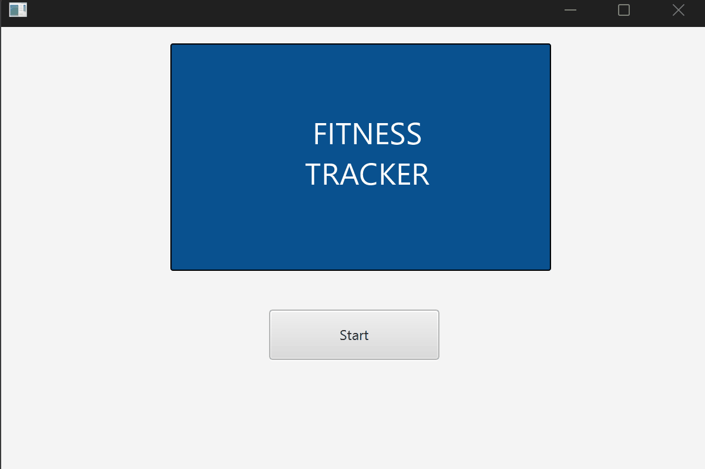
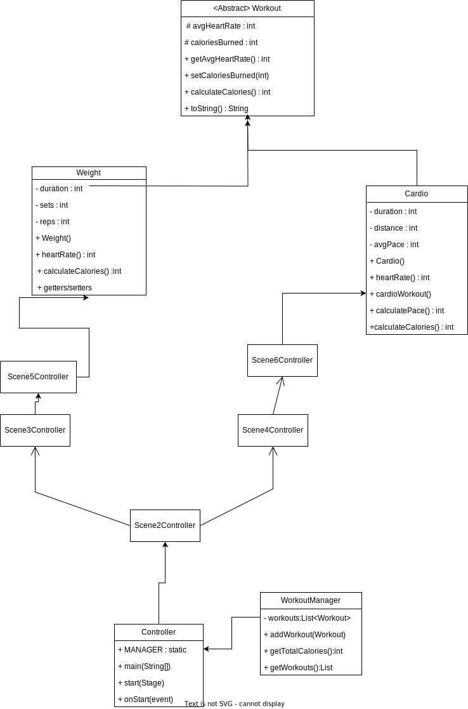

# Fitness Tracker

## Description

Fitness Tracker is an application that lets users log their cardio and weight training workouts to estimate heart rate and calories burned. The inspiration for this project came from the iPhone Fitness App. I wanted to recreate a simplified version that captures the core idea of logging a workout and getting useful feedback back. Using my previous work from UD1 and UD2, I built a 6 scene application backed by my abstract `Workout` superclass with `Cardio` and `Weight` subclasses, plus a `WorkoutManager` to track totals across sessions.

## Demo

## UML Diagram

## Wireframe

## UD1 Concepts Used

- **Abstraction** 
- **Inheritance** 
- **Encapsulation** 
- **Polymorphism** 
- **Composition / Aggregation** 
- **Exception handling**
- **Overriding 

